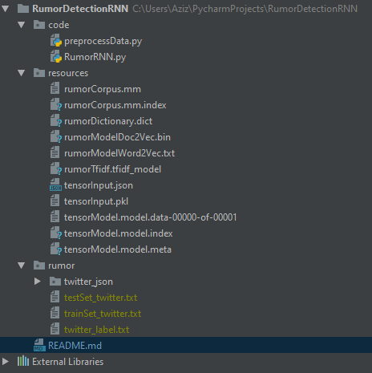

# RumorDetectionRNN

## Libraries used

1. gensim
2. tflearn
3. pickle

## Algorithm

### Dataset pre-process (preprocessData.py)

1. for each train file f in twitter_json, 
    1. put value of 'text' key in a list l, do this for all lines
    2. tfidf = compute tf*idf with l as input
    3. create tuple t (tfidf, ground_truth of f)
2. pickle.dump all tuples
3. do step 1 and 2 for test every test file

### Training neural network

1. load trainX, trainY, testX, testY using <code>loadTensorInput()</code> Each item is now a list of list
2. pad trainX and testX so that each item has the same length (currently 100 because of machine capability but should be around 8000)  
3. categorize trainY and testY to two classes
4. build the neural net model using tflearn (LSTM RNN)
    1. activation='softmax'
    2. optimizer='adam'
    3. learning_rate=0.001
    4. loss='categorical_crossentropy'
5. fit the model
    1. n_epoch=1, due to machine capability

## before running any file:

1. make sure that the dataset folder is inside the project amd has name 'rumor'

## To create folder resources:

1. run preprocessData.py main function (createTensorInput(inputFile))

## To train neural network:

1. run RumorRNN.py main function 

## Result

Excluding tensorflow warnings

<code>
Training samples: 117  
Validation samples: 875  

Training Step: 1  
| Adam | epoch: 000 | loss: 0.00000 - acc: 0.0000 -- iter: 032/117  
Training Step: 2  | total loss: 0.63003  
| Adam | epoch: 000 | loss: 0.63003 - acc: 0.5398 -- iter: 064/117  
Training Step: 3  | total loss: 0.68456  
| Adam | epoch: 000 | loss: 0.68456 - acc: 0.4836 -- iter: 096/117  
Training Step: 4  | total loss: 0.69145  
| Adam | epoch: 001 | loss: 0.69145 - acc: 0.5206 | val_loss: 0.69413 - val_acc: 0.4880 -- iter: 117/117  
Training Step: 4  | total loss: 0.69145  
| Adam | epoch: 001 | loss: 0.69145 - acc: 0.5206 | val_loss: 0.69413 - val_acc: 0.4880 -- iter: 117/117  
--  
</code>
